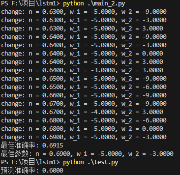

2025.10.30 

Thanks to Tushare(挖地兔)

**data_get** 从Tushare中获取玉米期货的日线数据

**basic_get** 从Tushare中获取玉米期货的基本信息

**data_1** 计算价格变化率与距离到期日时间

**data_2** 整合数据

**data_3** 整合数据

**data_4** 划分训练集与测试集 比例为8：2

**main_1** 计算得到价格变化率和涨跌分布散点图

**main_2** 
    参数1：n 上涨概率阈值
    参数2：w_1 价格变化率权重
    参数3：W_2 滚动窗口价格变化率均值权重(window = 3)

**test** 对测试集进行测试

adj_p = p_up + w_1 * mean + w_2 * adj_mean

p_up: 上涨所占比例(up / (up + down))

mean: 当日所有价格变化率加和

adj_mean: 滚动窗口价格变化率均值加和

adj_p > n : 预测上涨 

adj_p < 1 - n : 预测下跌

